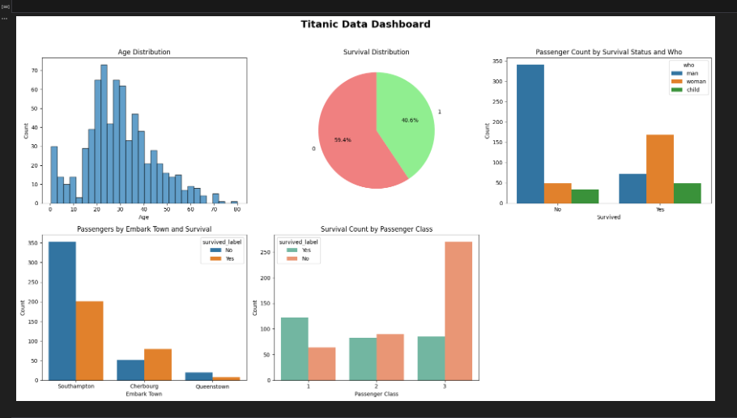

🚀 Overview

This project focuses on analyzing the Titanic dataset to uncover insights about passengers’ demographics, travel classes, and survival outcomes.
It includes data cleaning, exploratory analysis, and visualization using Python libraries to turn raw data into meaningful visual insights.

📈 Key Insights

Age Distribution → Understand the overall age range of passengers.

Survival Rate → Explore the ratio of survivors vs. non-survivors.

Survival by Passenger Type → Compare survival between men, women, and children.

Survival by Embarkation Town → Analyze how the port of departure affected survival.

Survival by Passenger Class → Identify which travel classes had the highest chance of survival.

Combined Dashboard → A single view displaying multiple visualizations together.

🧰 Tools & Libraries Used

Python

Pandas – Data loading and manipulation

NumPy – Numerical operations

Matplotlib – Static visualizations

Seaborn – Advanced and styled charts

💡 Future Enhancements

Add gender-based comparison of survival rates

Include correlation heatmap for better feature relationships

Extend project to predictive modeling using machine learning

👤 Author: Bassem Fathy – Data Analyst
📧 Email: baseemfathy5@gmail.com